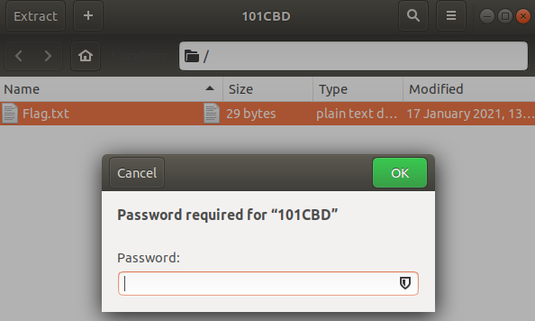
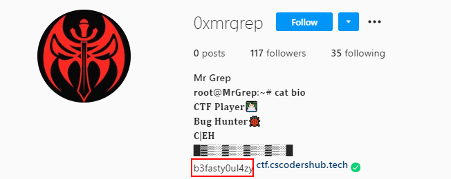
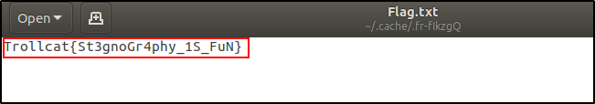

Over the weekends, I participated in TrollCat CTF, a CTF organized by CSCodersHub in India and [placed 23rd](https://ctftime.org/event/1257). Here are the write-ups for the challenges, including some challenges that I did not manage to solve during the CTF itself. Enjoy! 

## Stegnography

### Change My Mind

{: .box-note}
Change my mind. [Download File](https://drive.google.com/file/d/1KNqvQgkAwASizOwXiTkan4KXmoRIEj7W/view?usp=sharing).

{: .mx-auto.d-block :}

This is the image we have been provided with. Running the image with zsteg, we can see the flag.

{: .mx-auto.d-block :}

### Alien Message

{: .box-note}
A Space Agency has got an unknown audio signal they captured it in file. Help them to decode the message. [Download File](https://drive.google.com/file/d/1AQEw7sP4e8WdRnLxMhjIr4Nzeh5OKgJT/view?usp=sharing).

Opening the mp3 file in Audacity and playing the song, we observe that there are beeping sounds in the middle of the song as shown in the following waveform.

{: .mx-auto.d-block :}

The beeping sounds resemble morse code. Converting the waveform to morse code by representing the wider bars as "-" and thinner bars as ".", we get the following morse code: "- .-. --- .-.. .-.. -.-. .- - -.-. - ..-. -... .-. --- ..- --. .... - - --- -.-- --- ..- -... -.-- -.-. ... -.-. --- -.. . .-. ... .... ..- -...". When decoded, it gives us the flag "TROLLCATCTFBROUGHTTOYOUBYCSCODERSHUB".

### Trolling Cat

{: .box-note}
Don't mess with my cat. [Download File](https://drive.google.com/file/d/1OlHig8YlpeZ2KlbsYSgAP0jrjSz8JrFt/view?usp=sharing).
You Might Find Password on my social media if you need it ;)

Opening the .rar file, we see a .png image inside. 

{: .mx-auto.d-block :}

We extract the image and run binwalk. We see that there is a zip file inside which seems suspicious.

{: .mx-auto.d-block :}

We then extract the zip file using binwalk.

{: .mx-auto.d-block :}

Opening the zip file, we see that there is a flag.txt inside but it is password protected.

{: .mx-auto.d-block :}

Since the challenge description has mentioned that the password can be found on the author's social media account, we searched his instagram account and found a string that looks like the password on his bio.

{: .mx-auto.d-block :}

Unlocking the flag.txt with the password, we can see the flag!

{: .mx-auto.d-block :}

## Forensics

### Forbidden

{: .box-note}
Agent Troll recieved some file but not able to read the data can you help us? [Download File](https://ctf.cscodershub.tech/files/c46ffc7ac0a5a27387b4a35f04671302/trollcats.car?token=eyJ1c2VyX2lkIjo4NDUsInRlYW1faWQiOjIzMywiZmlsZV9pZCI6Mzh9.YCOYKA.eKvCW18yYhXcO23zhasLXa3MU94).

Running binwalk on the .car file, we can see that it contains a bzip2 compressed file.

{: .mx-auto.d-block :}

We use binwalk to extract the bzip2 file using the `--d=".*"` flag. Using bzip2 to unzip the bzip2 file, we `cat` the data in the file and obtained the flag!

{: .mx-auto.d-block :}

## the_sus_agent

{: .box-note}
One of our agent is doing something suspicious on the network can you find out? [Download File](https://mega.nz/file/DxUmUToR#ckGf6JffCW2M7TixQzcfQNx9Ki-66gXyNSA4lUX5Ooc).

Opening the .pcapng capture, we can see that there are a lot of TCP packets with some HTTP communication. I exported the HTTP objects and found 2 files which seemed interesting, 2 .jpg images secret.jpg and welcome.jpg.

We were unable to open secret.jpg by double-clicking the image, suggesting that the file extension is incorrect. Running file on secret.jpg, we can see that it contains ASCII text which is the string "aWhvcGV5b3VkaWRub3R0cmllZHRvYnJ1dGVmb3JjZWl0". Decoding the string using CyberChef by base64, we get the string "ihopeyoudidnottriedtobruteforceit" which looks like a password of some sort.

{: .mx-auto.d-block :}

Suspecting that the flag is hidden in welcome.jpg which requires a password to extract it, I ran steghide on welcome.jpg and passed "ihopeyoudidnottriedtobruteforceit" as the passphrase. 

{: .mx-auto.d-block :}

Opening the file "foryou", we can see the flag!

{: .mx-auto.d-block :}

## s3cr3t

{: .box-note}
After getting trolled alot by Mr.Troll we finally got some files and now he's hiding some secret with him your mission is to find that secret. [Challenge file link.](https://mega.nz/file/PtsFHYzY#tKDykxlC1Uj5FniYU947AMRFJubc8OL11l0jmMbxmbA)

The file is a .tar.gz compressed file which contains an .E01 image file. Extracting the file and running it on Autopsy, we see that there is a deleted file topsecret.vhdx. 

{: .mx-auto.d-block :}

We extract topsecret.vhdx and attempt to mount it by double clicking on it. However, we got a pop-up asking for the BitLocker password.

{: .mx-auto.d-block :}

While searching online on how to crack the BitLocker password, I came across a tool [bitcracker](https://github.com/e-ago/bitcracker) which can obtain the password hash from the BitLocker encrypted drive. The password can then be recovered by cracking the hash using John the Ripper.

Running bitcracker on topsecret.vhdx, we obtain the hashes which is stored in hash_user_pass.txt.

{: .mx-auto.d-block :}

We then crack the hash using John the Ripper and got the password "johncena".

{: .mx-auto.d-block :}

Using the password to mount the tool, we opened the drive only to find a file named "please dont open it.txt" which contains "Try Harder !!! :{".

{: .mx-auto.d-block :}

I then opened the drive in Autopsy and found a deleted file dont_open_it.txt which contains the flag!

{: .mx-auto.d-block :}

