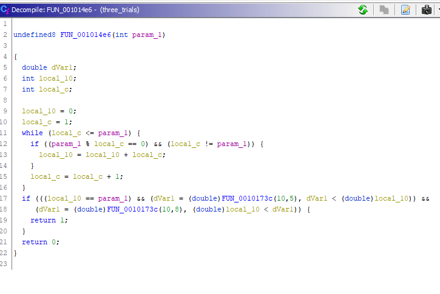

This time, I participated in a CTF held by DSO and NUS. This was the most challenging CTF I have ever participated in so far. Many of the challenges involved Reverse Engineering which I wasn't familiar with. However, I definitely learnt a lot from the CTF, especially in the areas of Mobile and Reverse Engineering! :)

## PWN

### Insecure

{: .box-note}
Someone once told me that SUID is a bad idea. Could you show me why?

This challenge involved using a SUID-enabled program `insecure` which temporarily elevates its privileges and calls another program `id`, to read `flag.txt` which we do not have permissions to read.

What I did was to create another program `id` which runs `cat flag.txt` and stored it in `/tmp`. In order to allow `insecure` to call this `/tmp/id` instead of `bin/id`, I updated the PATH variable to `/tmp`. When the  `insecure` program runs, `tmp/id` is called and the flag will be printed. 

The list of commands and output can be seen in the screenshot below.

{: .mx-auto.d-block :}

## Web & Crypto

### Easy Sql

The provided website contains an input box which outputs the corresponding strings if the input is valid. From the challenge name, we can assume that the challenge requires some sql injection methods.

Running the query `1';show databases;show tables;`, we can see the databases and tables shown below.

{: .mx-auto.d-block :}

Tha table `1919810931114514` looks interesting. Let's display the columns in the table using the query ``1';show columns from `1919810931114514` #``.

{: .mx-auto.d-block :}

We can see that there is a column named `flag` which likely contains the flag we are looking for.

When we try using a SELECT query such as ``1';select flag from `1919810931114514` #``, we get the following message `return preg_match("/set|prepare|rename|alter|select|update|delete|drop|insert|where|\./i",$inject);`. So it seems like we need to use other SQL commands to retrieve the flag.

I came across a similar CTF question [here](https://www.damyahome.top/BUUCTF-web%E7%BB%83%E4%B9%A05/) and used the query ``1'; handler `1919810931114514` open; handler `1919810931114514` read first; #``. The flag is shown in the output.

{: .mx-auto.d-block :}

## Mobile

### Login

{: .box-note}
It's time for a simple, relaxing challenge.
Can you find the correct credentials?
 [Download File](https://nusdsoctf2.s3-ap-southeast-1.amazonaws.com/S3/Login/login.apk).

Emulating the apk on Android Studio, we can see that the mobile application contains a login screen where we need to provide the username and password to login.

We first use `apktool` to disassemble `login.apk` using the command `apktool -d login.apk`. We also open login.apk in `jadx` to convert DEX/Smali code to Java which is easier to read.

We find the following function which checks whether the credentials are correct. From the first `if` statement, we can see that the userid is `5573657231333337` which convert to string from hex is `User1337`.
 
{: .mx-auto.d-block :}

The second `if` statement shows that the first 4 characters of the password is compareed to `getJavaPassword()`. 

{: .mx-auto.d-block :}

{: .mx-auto.d-block :}

{: .mx-auto.d-block :}

Tracing the code, we can see that we need to use AES to decode `7470CB2F2412053D0A3CEC3D07CAE4A4` using the key `!@#$%^&*()_+abcd`. 

{: .mx-auto.d-block :}

Decoding the base64 string, we get `L1v3` which is the first 4 characters of the password.

The third `if` statement shows that the remaining portion of the password is checked against `getNativePassword()` which is a native function and we can see that a library was loaded.

{: .mx-auto.d-block :}

Navigating to the `lib` folder, we see a file `libddea.so`. Opening `libddea.so` in Ghidra and navigating to the getNativePassword function, we see a bunch of XORs. 

{: .mx-auto.d-block :}

The values used can be seen here.

{: .mx-auto.d-block :}

We XOR the values and get the resultant hex values `70 32 5a 7a 77 30 72 44`. Converting to ASCII, we get `p2Zzw0rD`.

Hence, the credentials are:
- Username: User1337
- Password: L1v3p2Zzw0rD

We use the credentials to login and get a message saying the flag is printed to logcat. 

{: .mx-auto.d-block :}

Going to the logcat terminal, we see the flag!

{: .mx-auto.d-block :}

## Reverse Engineering

### Three Trials 

{: .box-note}
Reverse the binary, understand the conditions, dust out your math textbooks and solve the trials!
 [Download File](https://nusdsoctf2.s3-ap-southeast-1.amazonaws.com/S3/Three_trials/three_trials).

Open the file in Ghidra, we go to the `entry` function and see that the program checks for 3 integer input which are then processed using a function each.

{: .mx-auto.d-block :}

The first function checks that the sum of cube of digits in a number = the number. 

{: .mx-auto.d-block :}

For n=3, there are only 4 such numbers, 153, 370, 371 and 407 based on the reference [here](https://math.stackexchange.com/questions/635694/sum-of-cubes-of-the-digits-of-a-number-equal-to-the-number). Since the number is between 400 and 900, the first number is 407.

The third function checks that the number is the sum of its factors, aka Perfect Number. 

{: .mx-auto.d-block :}

From [Wikipedia](https://en.wikipedia.org/wiki/List_of_perfect_numbers), the only perfect number between 10^5 and 10^8 is 33550336. Hence, the third number is 33550336.

For the second number, the function checks that for the square of the number, when split into 2, if the sum of the 2 numbers = the number itself. So for example, given a number x = 9
x^2 = 81
Cut x^2 by 10^n where n is any number < no. of digits in x^2 e.g n=1
Sum = 8 + 1 = 9 which is x.

{: .mx-auto.d-block :}

We realise that there are multiple possible answers such as 55, 99 etc. Hence, we used the C++ code decompiled by Ghidra and brute forced for possible answers.

{: .mx-auto.d-block :}

The list of numbers can be shown below.

{: .mx-auto.d-block :}

We tested the numbers using the program and the password `407 38962 33550336` succeeded!

{: .mx-auto.d-block :}

