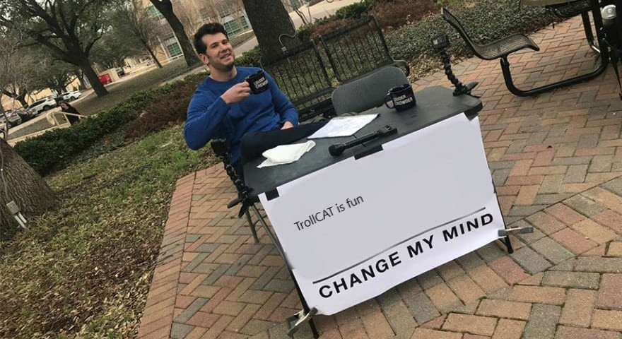
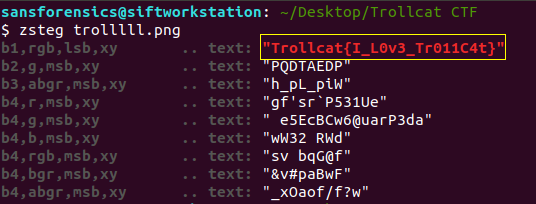

This time, I participated in a CTF held by DSO and NUS. This was the most challenging CTF I have ever participated in so far. Many of the challenges involved Reverse Engineering which I wasn't familiar with. However, I definitely learnt a lot from the CTF, especially in the areas of Mobile and Reverse Engineering! :)

## Web & Crypto

### Easy Sql

{: .box-note}
Change my mind. [Download File](https://drive.google.com/file/d/1KNqvQgkAwASizOwXiTkan4KXmoRIEj7W/view?usp=sharing).

{: .mx-auto.d-block :}

This is the image we have been provided with. Running the image with zsteg, we can see the flag.

{: .mx-auto.d-block :}
