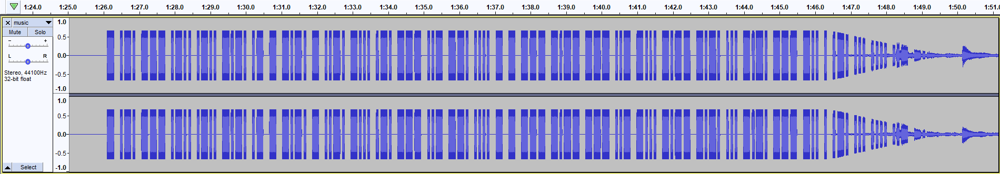

Over the weekends, I participated in TrollCat CTF, a CTF organized by CSCodersHub in India and [placed 23rd](https://ctftime.org/event/1257). Here are the write-ups for the challenges, including some challenges that I did not manage to solve during the CTF itself. Enjoy! 

## Stegnography

### Alien Message

{: .box-note}
A Space Agency has got an unknown audio signal they captured it in file. Help them to decode the message. [Download File](https://drive.google.com/file/d/1AQEw7sP4e8WdRnLxMhjIr4Nzeh5OKgJT/view?usp=sharing).

Opening the mp3 file in Audacity and playing the song, we observe that there are beeping sounds in the middle of the song as shown in the following waveform.

{: .mx-auto.d-block :}

The beeping sounds resemble morse code. Hence, we decoded the sounds to the following morse code "- .-. --- .-.. .-.. -.-. .- - -.-. - ..-. -... .-. --- ..- --. .... - - --- -.-- --- ..- -... -.-- -.-. ... -.-. --- -.. . .-. ... .... ..- -...". When decoded, it gives us the string "TROLLCATCTFBROUGHTTOYOUBYCSCODERSHUB.

