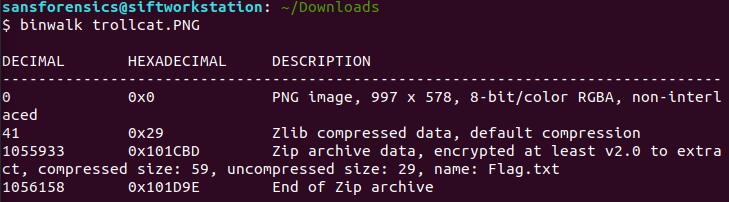

Over the weekends, I participated in TrollCat CTF, a CTF organized by CSCodersHub in India and [placed 23rd](https://ctftime.org/event/1257). Here are the write-ups for the challenges, including some challenges that I did not manage to solve during the CTF itself. Enjoy! 

## Stegnography

### Change My Mind

{: .box-note}
Change my mind. [Download File](https://drive.google.com/file/d/1KNqvQgkAwASizOwXiTkan4KXmoRIEj7W/view?usp=sharing).

{: .mx-auto.d-block :}

This is the image we have been provided with. Running the image with zsteg, we can see the flag.

{: .mx-auto.d-block :}

### Alien Message

{: .box-note}
A Space Agency has got an unknown audio signal they captured it in file. Help them to decode the message. [Download File](https://drive.google.com/file/d/1AQEw7sP4e8WdRnLxMhjIr4Nzeh5OKgJT/view?usp=sharing).

Opening the mp3 file in Audacity and playing the song, we observe that there are beeping sounds in the middle of the song as shown in the following waveform.

{: .mx-auto.d-block :}

The beeping sounds resemble morse code. Converting the waveform to morse code by representing the wider bars as "-" and thinner bars as ".', we get the following morse code: "- .-. --- .-.. .-.. -.-. .- - -.-. - ..-. -... .-. --- ..- --. .... - - --- -.-- --- ..- -... -.-- -.-. ... -.-. --- -.. . .-. ... .... ..- -...". When decoded, it gives us the flag "TROLLCATCTFBROUGHTTOYOUBYCSCODERSHUB".

### Trolling Cat

{: .box-note}
Don't mess with my cat. [Download File](https://drive.google.com/file/d/1OlHig8YlpeZ2KlbsYSgAP0jrjSz8JrFt/view?usp=sharing)
You Might Find Password on my social media if you need it ;)

Opening the .rar file, we see a .png image inside. 

{: .mx-auto.d-block :}

We extract the image and run binwalk. We see that there is a zip file inside which seems suspicious.

{: .mx-auto.d-block :}

We then extract the zip file using binwalk.

{: .mx-auto.d-block :}

Opening the zip file, we see that there is a flag.txt inside but it is password protected.

{: .mx-auto.d-block :}

Since the challenge description has mentioned that the password can be found on the author's social media account, we searched his instagram account and found a string that looks like the password on his bio.

{: .mx-auto.d-block :}

Unlocking the flag.txt with the password, we can see the flag!

{: .mx-auto.d-block :}

